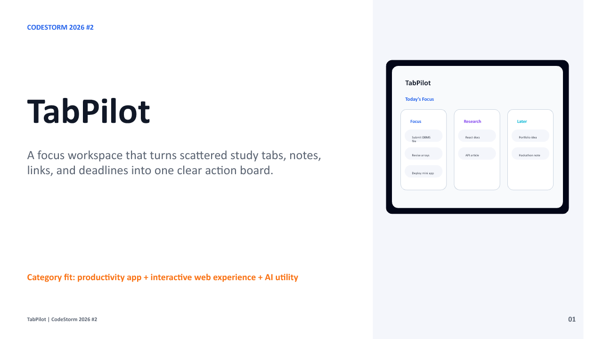

# TabPilot: Focus Workspace for Students



TabPilot is an interactive student productivity workspace that turns scattered
browser tabs, study links, notes, deadlines, and tasks into one clear focus
board.

Built for **CodeStorm 2026 #2**.

## Demo

- Demo video: https://files.catbox.moe/oj2c4r.mp4
- GitHub repository: https://github.com/aniket01jan2008-svg/tabpilot

## Problem Statement

Students often keep many resources open at once: PDFs, YouTube lectures,
documentation, notes, coding references, deadlines, and chat messages. The
resources are useful, but they are spread across too many places.

This creates three common problems:

- Too much context switching between tabs and apps
- Important links and notes get lost during study or project work
- Students spend more time managing resources than finishing the task

## Solution Overview

TabPilot gives students a focused workspace for each study or project session.
Instead of leaving resources scattered across browser windows, students can
capture important links, group them by purpose, and convert the session into a
small action board.

The goal is simple: help students start faster, stay focused, and resume work
without losing context.

## Key Features

- **Quick capture:** Save study links, notes, tasks, and deadlines in one place.
- **Workspace lanes:** Organize resources into Focus, Research, and Later.
- **Three-task board:** Convert a messy session into the next three useful
  actions.
- **Dashboard preview:** See a clean overview of the current study/project
  session.
- **Student-first use cases:** Built around assignments, exam prep, coding,
  hackathons, and self-learning.

## Tech Stack

- React
- TypeScript
- Vite
- CSS
- GitHub for version control and public project proof

## Current Status

This repository contains an interactive frontend MVP:

- responsive landing page
- create and switch study/project sessions
- add categorized resource links
- add up to three focus tasks per session
- mark focus tasks complete
- save MVP data in browser local storage
- product explanation sections
- dashboard-style preview
- project branding/media
- hackathon-ready README and demo link

## Future Scope

- Browser extension to capture the current tab instantly
- Login and cloud sync for saved workspaces
- Pomodoro/focus timer mode
- AI summaries for saved resources
- Smart tab grouping by subject or project
- Team/shared workspaces for group assignments and hackathons

## Run Locally

```bash
npm install
npm run dev
```

## Build

```bash
npm run build
```

## License

MIT
